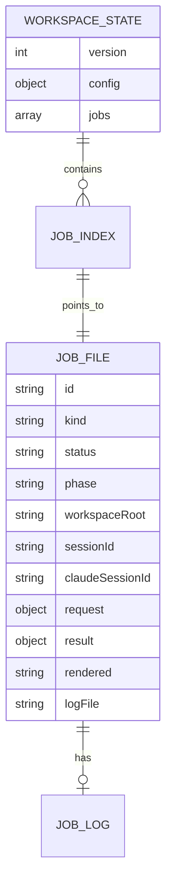

# Claude Code Plugin For Codex设计文档

## 一、修订历史

| 版本号 | 修订内容 | 修订时间 | 修订人 |
|---|---|---|---|
| V1.0.0 | 新建初稿，固化 Codex 到 Claude Code 反向插件的需求与技术方案 | 2026-06-05 | Codex |

## 二、需求信息

### 2.1 需求背景

- 背景：用户已分析 `openai/codex-plugin-cc`，希望反向实现一个从 Codex 调用 Claude Code 的本地插件。目标是行为上对齐 `codex-plugin-cc`，但承载面从 Claude Code plugin 变为 Codex plugin。
- 需求目的：在 Codex 中通过 skills 把审查、诊断、修复或长任务委托给本机 Claude Code，并能管理后台任务、结果、取消和恢复。
- 目标用户/使用方：在同一机器上同时使用 Codex 与 Claude Code 的开发者。
- 需求链接：
  - `https://github.com/openai/codex-plugin-cc`
  - `https://code.claude.com/docs/en/agent-sdk/overview`
  - `https://code.claude.com/docs/en/agent-sdk/typescript`
  - `https://code.claude.com/docs/en/agent-sdk/sessions`
  - `https://code.claude.com/docs/en/agent-sdk/streaming-vs-single-mode`
  - `https://code.claude.com/docs/en/agent-sdk/slash-commands`
- 关联原始材料：
  - 本地克隆仓库：`/Users/zhangyukun/project/temp/codex-plugin-cc`
  - 需求澄清包：`.loopx/intake/clarify-claude-code-plugin-codex-2026-06-05-175606.md`

### 2.2 需求范围

- 本期范围：
  - 新建本地 Codex plugin 项目：`/Users/zhangyukun/project/temp/claude-code-plugin-codex`。
  - Codex plugin manifest 名称：`claude-code`。
  - 提供 skills：`claude-code-setup`、`claude-code-task`、`claude-code-review`、`claude-code-adversarial-review`、`claude-code-status`、`claude-code-result`、`claude-code-cancel`。
  - 使用 Claude Agent SDK 作为主运行时。
  - 实现统一 companion runtime、共享 broker、本地 job 状态、前台/后台执行、resume、cancel、review。
  - 使用 Node.js ESM `.mjs` 和 `node:test`。
  - 支持 macOS/Linux，保留 Windows named pipe 适配和测试。
- 非目标：
  - 不做 MCP tools。
  - 不承诺 `/claude:*` slash command。
  - 不做 marketplace 发布流程。
  - 不接入用户已打开的 Claude Code TUI 会话。
  - 不扫描或接管本插件之外创建的 Claude session。
  - 不做 Claude Remote Control、Channels、stop-time review gate。
  - 默认测试不调用真实 Claude API。
- 决策边界：
  - SDK 字段名、事件类型、slash command 可用性可在实现时按实际版本微调。
  - 若要增加 MCP、marketplace、Remote Control、Channels、stop gate 或外部 session 接管，必须回到 spec。
  - 若原生 review 在 SDK 中不可用，本期允许 fallback 到 prompt-based review。
- 依赖方：
  - 本机 Codex plugin 系统。
  - 本机 Claude Code CLI。
  - `@anthropic-ai/claude-agent-sdk`。
  - Git。
  - Node.js。
- 约束条件：
  - SDK 依赖作为项目本地 dependency，`setup` 只检查不自动安装。
  - 不自动登录 Claude Code。
  - 不默认危险权限。
  - 复用 `codex-plugin-cc` Apache-2.0 代码时保留 LICENSE/NOTICE。

### 2.3 可行性分析

- 业务可行性：可行。用户需求明确，目标是本地开发辅助，不涉及外部 SaaS 发布或多租户。
- 技术可行性：可行。Codex plugin 能承载 skills/scripts；Claude Agent SDK 提供程序化运行 Claude Code、session、streaming、slash command、权限和中断等能力。需实现时校验 SDK 当前版本的精确 API。
- 团队接受能力：较高。结构可对齐已读过的 `codex-plugin-cc`，通用代码可复用。
- 时间成本：中等。主要成本在 SDK event parser、broker、state/job 管理和测试夹具。
- 资源成本：本地文件和进程资源；真实 smoke test 会消耗 Claude 使用额度。
- 替代方案：
  - 仅 shell 调 `claude -p`：实现简单但能力不足，拒绝作为主路径。
  - MCP tools：用户明确拒绝。
  - 不做 broker：用户明确希望做 broker。
- 关键风险：
  - Claude Agent SDK 的 slash command、permission、interrupt API 与预期不完全一致。
  - Native `/review` 不一定在所有版本可 dispatch。
  - Codex skill 触发不如 slash command 明确，需要 README 要求显式点名 skill。

## 三、概要设计

### 3.1 方案总述

- 设计目标：
  - 行为上反向对齐 `codex-plugin-cc`。
  - 在 Codex 内通过 skills 委托 Claude Code 完成 review/task。
  - 支持后台任务、状态查看、结果查看、取消、resume。
  - 保持权限边界清晰：review 只读，task 默认 workspace-write，不默认 dangerous bypass。
- 总体思路：
  - Codex skill 是用户入口，只做薄指令。
  - `cc-companion.mjs` 是统一命令入口，负责参数、job、render、状态。
  - `claude-broker.mjs` 是共享 runtime broker，按 workspace 串行处理一个 active Claude job。
  - `lib/claude.mjs` 封装 Claude Agent SDK。
  - `lib/state.mjs`、`lib/job-control.mjs`、`lib/tracked-jobs.mjs` 管理本地状态。
- 核心模块：
  - Plugin manifest。
  - Skills。
  - Companion CLI。
  - Claude runtime wrapper。
  - Broker。
  - State/job/log。
  - Git review context。
  - Renderer。
  - Fake SDK tests。
- 主要难点：
  - SDK event stream 转换为稳定 job result。
  - Broker 串行/interrupt 行为。
  - Native review 优先但 fallback 稳定。
  - 权限映射。
- 技术指标：
  - 单 workspace 同时最多一个 active execution job。
  - job state 最多保留 50 条。
  - 默认测试不触发真实 Claude API。
  - 普通任务能返回 Claude final answer；review 能返回 findings 或原生 review 输出。

### 3.2 整体架构设计

- 业务模式：本地插件委托模式。Codex 作为主会话，Claude Code 作为本地被委托 agent runtime。
- 系统边界：
  - Codex plugin 边界：skills/scripts/local state。
  - Claude Code 边界：Agent SDK/CLI/auth/config。
  - Git/workspace 边界：只在当前 workspace 内收集 diff 和执行。
- 上下游系统：
  - 上游：Codex 用户请求。
  - 下游：Claude Agent SDK、Claude Code CLI、Git、文件系统。
- 应用架构：
  - `skills/*/SKILL.md` 指示 Codex 调用 companion。
  - `cc-companion.mjs` 暴露 subcommands：`setup`、`task`、`review`、`adversarial-review`、`status`、`result`、`cancel`、`task-worker`。
  - `claude-broker.mjs` 暴露本地 socket，维护单 active job。
- 技术架构：
  - Node.js ESM。
  - Local JSON state。
  - Unix socket / Windows named pipe broker endpoint。
  - Claude Agent SDK query/session API。
- 数据流转：
  - Codex skill -> companion command -> state/job init -> broker/runtime -> Claude SDK event stream -> job result/log -> Codex rendered output。

### 3.3 核心流程设计

| 流程 | 触发条件 | 参与系统/模块 | 主流程 | 异常/补偿 | 输出 |
|---|---|---|---|---|---|
| setup | 用户要求检查 Claude Code 可用性 | skill、companion、Claude CLI、SDK | 检查 node、claude CLI、SDK import、auth/readiness、broker状态 | 缺依赖或未登录时输出明确 next steps，不自动安装/登录 | setup report |
| foreground task | 用户用 `claude-code-task` 且未要求后台 | skill、companion、broker、Claude SDK | 创建 job，连接 broker，启动 Claude task，收集事件，渲染 final answer | SDK 失败则记录 failed job；broker busy 则提示 busy | Claude final answer |
| background task | 用户明确要求后台或复杂任务被判断为后台 | skill、companion、worker、broker、state | 创建 queued job，detached worker 执行，status/result 查询 | worker 失败写 failed；cancel 可中断/kill | job id 和 status/result |
| review | 用户用 `claude-code-review` | skill、git、companion、Claude SDK | 解析 target，优先 SDK slash command native review；不可用则 prompt fallback | 无 diff 时明确说明；native 不可用 fallback | review 输出 |
| adversarial review | 用户用 `claude-code-adversarial-review` | skill、git、companion、Claude SDK | 收集 review context，发送 challenge prompt，要求 JSON，渲染 findings | JSON parse 失败时显示 raw output 和 parse error | structured review result |
| resume | 用户要求继续上次插件任务 | companion、state、Claude SDK | 查找本 workspace 最近完成 task 的 session id，resume 后发送继续 prompt | active job 存在时拒绝 resume；无记录时报错 | resumed task output |
| cancel | 用户取消 active job | companion、broker、state、process | 找到 active job，优先 SDK interrupt，失败则 terminate process | 无 active job 报错；跨 session 按 job id 可取消 | cancel report |

### 3.4 功能模块

| 模块 | 职责 | 关键功能 | 依赖 | 备注 |
|---|---|---|---|---|
| Plugin Manifest | 声明 Codex plugin | `.codex-plugin/plugin.json` | Codex plugin system | name 为 `claude-code` |
| Skills | 用户入口和行为约束 | setup/task/review/status/result/cancel 指令 | Codex skill loader | 不使用 MCP |
| Companion | 统一命令入口 | 参数解析、job 创建、调用 broker/runtime、渲染 | Node.js | 对齐 `codex-companion.mjs` |
| Claude Runtime | SDK 封装 | query、resume、slash command、event capture、interrupt | Claude Agent SDK | 需按 SDK 版本校验字段 |
| Broker | 共享 runtime 管控 | socket、busy、active job、interrupt、shutdown | Node net/os | 单 workspace 单 active job |
| State | 本地持久化 | state.json、job JSON、logs、prune | fs/os/crypto | 最多 50 job |
| Git Context | review target | working tree、base branch、diff summary | git | 可复用 `codex-plugin-cc` 思路 |
| Renderer | 用户输出 | setup/status/result/review/cancel 渲染 | 无 | task 原文优先 |
| Tests | 验证 | fake SDK、state、broker、commands | node:test | 不调用真实 API |

### 3.5 新增/调整功能说明

本项目是新增本地 Codex plugin，不调整现有 `codex-plugin-cc`。

新增功能：

- 从 Codex 调用 Claude Code task。
- 从 Codex 调用 Claude Code review。
- 本地后台 job 管理。
- 本地 shared broker。
- 仅 skill 的 Codex plugin 入口。

## 四、详细设计

### 4.1 Plugin 与 Skill 入口详细设计

#### 4.1.1 需求内容

- 入口：Codex skills。
- 操作人/调用方：Codex 用户。
- 前置条件：插件安装并启用，skills 可被 Codex 发现。
- 输出结果：Codex 按 skill 指令调用 companion 并返回 companion 输出。

#### 4.1.2 方案设计

- 核心逻辑：
  - `.codex-plugin/plugin.json` 声明 `name: "claude-code"`、description、skills path。
  - 每个 skill 是薄指令，要求 Codex 只调用 `node "${PLUGIN_ROOT}/scripts/cc-companion.mjs" <subcommand> ...`。
  - skill 描述要鼓励显式触发，如“Use when user asks Codex to delegate to Claude Code”。
- 状态流转：无业务状态，状态由 companion 管理。
- 数据变更：无。
- 计算公式：不涉及。
- 幂等设计：重复触发会创建新的 job，除非用户明确 resume。
- 权限/越权控制：
  - skill 明确禁止 Codex 自己替代 Claude 做任务。
  - skill 要求返回 companion stdout，不自行总结或改写关键结果。
- 异常处理：
  - companion 失败时返回错误。
- 补偿/重试：
  - 用户可重新执行 setup/task。
- 日志与审计：
  - skill 不单独记录，companion 记录 job log。

#### 4.1.3 流程步骤

1. 用户显式要求使用某个 `claude-code-*` skill。
2. Codex 加载 skill。
3. skill 解析用户意图和 flags。
4. skill 调用 companion。
5. skill 返回 companion stdout。

#### 4.1.4 边界条件

| 场景 | 处理方式 | 用户/调用方感知 | 监控/告警 |
|---|---|---|---|
| 用户未显式点名 skill | 不保证自动触发 | README 引导显式点名 | 不涉及 |
| companion 不存在 | skill 报插件安装异常 | 看到错误 | 不涉及 |
| 用户要求 MCP | 不支持 v1 | 明确非目标 | 不涉及 |

### 4.2 Companion CLI 详细设计

#### 4.2.1 需求内容

- 入口：`node scripts/cc-companion.mjs <subcommand>`.
- 操作人/调用方：Codex skill 或 detached worker。
- 前置条件：Node.js 可运行，项目依赖已安装。
- 输出结果：Markdown 或 JSON 格式报告。

#### 4.2.2 方案设计

- 核心逻辑：
  - 支持 subcommands：`setup`、`task`、`review`、`adversarial-review`、`status`、`result`、`cancel`、`task-worker`、`resume-candidate`。
  - 参数解析支持 raw string 和 argv array。
  - 创建 job record 后调用 broker/runtime。
  - foreground 直接等待 result。
  - background 创建 queued job 和 detached worker。
- 状态流转：
  - `queued -> running -> completed|failed|cancelled`。
  - phase 可为 `queued`、`starting`、`reviewing`、`investigating`、`editing`、`verifying`、`finalizing`、`done`、`failed`、`cancelled`。
- 数据变更：
  - 写 `state.json`。
  - 写 `jobs/<job-id>.json`。
  - 写 `jobs/<job-id>.log`。
- 幂等设计：
  - status/result/cancel 按 job id 或最近 job 查询。
  - task/review 每次新建 job。
- 权限/越权控制：
  - companion 根据 subcommand 映射 Claude permission mode。
  - review 不允许写。
  - task 默认允许 workspace-write 等价权限。
- 异常处理：
  - CLI 不可用、SDK 缺失、auth 失败、broker busy、SDK error 均记录 failed 或返回明确错误。
- 补偿/重试：
  - 用户可重新运行。
  - background job 失败后 result 显示错误和 log 路径。
- 日志与审计：
  - 每个 job 记录 progress、final output、error、session id。

#### 4.2.3 流程步骤

1. 解析 subcommand 和 options。
2. resolve workspace root。
3. 读取或初始化 state。
4. 对执行型命令创建 job。
5. 连接 broker 或启动 broker。
6. 调用 Claude runtime。
7. 捕获事件和 final output。
8. 写 job result。
9. 渲染 stdout。

#### 4.2.4 边界条件

| 场景 | 处理方式 | 用户/调用方感知 | 监控/告警 |
|---|---|---|---|
| 无 prompt 且非 resume | 报错 | 提示提供任务 | job failed 或直接 stderr |
| broker busy | 执行请求返回 busy | 提示先 status/cancel | log busy |
| job id 前缀歧义 | 报错要求更长 id | 明确错误 | 不涉及 |
| active job 存在时 resume | 拒绝 | 提示先 status/cancel | 不涉及 |

### 4.3 Claude Runtime 详细设计

#### 4.3.1 需求内容

- 入口：companion 或 broker 调用 runtime wrapper。
- 操作人/调用方：内部模块。
- 前置条件：`@anthropic-ai/claude-agent-sdk` 可 import，Claude Code auth 可用。
- 输出结果：统一 `ClaudeRunResult`。

#### 4.3.2 方案设计

- 核心逻辑：
  - 封装 Claude Agent SDK query/session API。
  - 支持新建 session、resume session、发送 prompt、尝试 dispatch slash command、interrupt。
  - 捕获 SDK stream messages，提取：
    - session id
    - final assistant message
    - tool use / command / file change progress
    - error
    - structured output
  - task 使用普通 prompt。
  - native review 优先检查 slash command 可用性并 dispatch `/review` 或等价命令。
  - fallback review 使用 prompt。
- 状态流转：
  - runtime 内部 tracking：`starting -> running -> finalizing -> completed|failed|interrupted`。
- 数据变更：
  - Claude Code 可在 task 写模式修改 workspace。
  - runtime 不直接写 job state，由 companion/tracked job 写。
- 计算公式：不涉及。
- 幂等设计：
  - resume 使用记录的 session id，不重复扫描外部 session。
- 权限/越权控制：
  - review/adversarial-review 设置只读或只允许读类工具。
  - task 设置 workspace-write 等价权限。
  - dangerous bypass 仅用户明确要求。
  - 实现时必须按 SDK 实际 `permissionMode`、allowed/disallowed tools 字段校验。
- 异常处理：
  - SDK import 失败、query 失败、auth 失败、unsupported command 都转换为 runtime error。
  - native review unavailable 不是失败，应 fallback。
- 补偿/重试：
  - interrupted/cancelled 后可重新创建 job。
  - resume 可继续最近完成的 plugin-created session。
- 日志与审计：
  - 记录 session id、progress、final output。
  - 不记录 API key、tokens、环境密钥。

#### 4.3.3 流程步骤

1. 构造 SDK options：cwd、model、effort、permission mode、session mode。
2. 如 resume，传入 session id 或 resume 参数。
3. 启动 query 或 streaming input。
4. 消费 SDK messages。
5. 更新 progress callback。
6. 捕获 final output。
7. 返回统一 result。

#### 4.3.4 边界条件

| 场景 | 处理方式 | 用户/调用方感知 | 监控/告警 |
|---|---|---|---|
| SDK 不支持某字段 | setup 或运行时报 capability error | 提示版本/字段问题 | log error |
| `/review` 不可 dispatch | fallback prompt review | 输出标明 fallback | log fallback |
| permission mode 不匹配 | 实现时校验并调整 | setup/report 风险 | 测试覆盖 |
| interrupt 不可用 | process kill fallback | cancel report 标明 | log interrupt failure |

### 4.4 Broker 详细设计

#### 4.4.1 需求内容

- 入口：companion 连接本地 endpoint。
- 操作人/调用方：companion foreground/worker/cancel。
- 前置条件：workspace root 可解析。
- 输出结果：broker 转发 runtime result 或 busy/error。

#### 4.4.2 方案设计

- 核心逻辑：
  - 单 workspace 单 broker。
  - broker detached process。
  - endpoint 存入 broker session state。
  - macOS/Linux 使用 Unix socket，Windows 使用 named pipe。
  - broker 同时只允许一个 active execution request。
  - active 时新的 task/review 返回 busy，不排队。
  - cancel request 可打断 active job。
- 状态流转：
  - broker state：`idle -> busy -> idle`。
  - broker process：`starting -> ready -> shutting_down`。
- 数据变更：
  - 写 broker session file：endpoint、pid、log、session dir。
- 计算公式：不涉及。
- 幂等设计：
  - ensure broker 会复用 ready endpoint。
  - stale broker session 会清理后重建。
- 权限/越权控制：
  - endpoint 位于本地临时目录。
  - 不暴露网络端口。
- 异常处理：
  - endpoint 不可连则重建。
  - broker busy 返回错误码。
  - broker crash 后 companion 可 fallback 直接运行或重启，具体由 plan 决定。
- 补偿/重试：
  - cleanup 删除 stale socket/pid/log。
- 日志与审计：
  - broker log 记录启动、busy、shutdown、runtime error。

#### 4.4.3 流程步骤

1. companion 调 `ensureBrokerSession(workspaceRoot)`。
2. 若已有 endpoint 可连，复用。
3. 否则创建 session dir 和 endpoint。
4. spawn detached broker。
5. companion 连接 endpoint 发送 JSONL request。
6. broker 调 Claude runtime。
7. broker 返回 result 或 error。

#### 4.4.4 边界条件

| 场景 | 处理方式 | 用户/调用方感知 | 监控/告警 |
|---|---|---|---|
| broker 启动超时 | 清理并报错 | setup/task 失败 | broker log |
| active job 时新执行请求 | 返回 busy | 提示先 status/cancel | log busy |
| cancel 非 active job | companion 查 state 后拒绝 | 明确错误 | 不涉及 |
| broker endpoint 文件残留 | teardown 后重建 | 无或短错误 | log cleanup |

### 4.5 Review 详细设计

#### 4.5.1 需求内容

- 入口：`claude-code-review`、`claude-code-adversarial-review`。
- 操作人/调用方：Codex 用户。
- 前置条件：当前目录为 Git repo。
- 输出结果：review report。

#### 4.5.2 方案设计

- 核心逻辑：
  - review target 选择对齐 `codex-plugin-cc`：
    - 显式 `--base <ref>` -> branch diff。
    - 显式 working tree -> working tree。
    - auto：dirty repo -> working tree，否则 default branch。
  - 普通 review：
    - 优先 native review slash command。
    - native 不可用时 fallback prompt review。
    - 不支持 staged-only/unstaged-only。
  - adversarial review：
    - 使用自定义 challenge prompt。
    - 允许 focus text。
    - 要求结构化 JSON：`verdict`、`summary`、`findings`、`next_steps`。
  - 小 diff inline，大 diff 传摘要并要求 Claude 用只读命令自查。
- 状态流转：
  - job phase：`starting -> reviewing -> finalizing -> done|failed`。
- 数据变更：
  - 只读 review 不应修改 workspace。
- 计算公式：
  - inline diff 阈值可沿用 `codex-plugin-cc` 默认：文件数和字节数阈值由实现配置。
- 幂等设计：
  - review 每次新 job，不复用旧结果。
- 权限/越权控制：
  - review permission 必须只读。
  - prompt 明确禁止修改文件。
- 异常处理：
  - 非 git repo 报错。
  - default branch 无法检测时要求 `--base`。
  - structured JSON parse 失败时显示 raw output。
- 补偿/重试：
  - 用户可传更明确 base 或 focus 重试。
- 日志与审计：
  - 记录 target、mode、fallback/native path、raw output、parse error。

#### 4.5.3 流程步骤

1. 解析 review 参数。
2. 解析 target。
3. 普通 review 尝试 native review。
4. 若 native 不可用，构造 fallback prompt。
5. adversarial review 构造 challenge prompt。
6. 调 Claude runtime。
7. 渲染 review result。

#### 4.5.4 边界条件

| 场景 | 处理方式 | 用户/调用方感知 | 监控/告警 |
|---|---|---|---|
| 没有 diff | 输出无可审查内容或建议指定 base | 明确 | 不涉及 |
| native review 不可用 | fallback | 输出标明 fallback | log fallback |
| 大 diff | 不 inline，要求 Claude 自查 | 结果正常 | log input mode |
| JSON parse 失败 | 显示 raw output 和 parse error | 可 debug | job result |

### 4.6 State/Job/Result 详细设计

#### 4.6.1 需求内容

- 入口：所有 companion 命令。
- 操作人/调用方：companion、worker、broker。
- 前置条件：可写本地 state dir。
- 输出结果：可查询 job 状态和结果。

#### 4.6.2 方案设计

- 核心逻辑：
  - 状态目录优先使用 Codex plugin data env，如果无则 fallback `/tmp/claude-code-companion`。
  - workspace root 先 realpath，再 sha256 hash 取 16 位，结合 basename 作为目录名。
  - `state.json` 存 config 和最近 job index。
  - `jobs/<id>.json` 存完整 job。
  - `jobs/<id>.log` 存日志。
  - 最多保留 50 jobs，prune 时删除 job JSON 和 log。
- 状态流转：
  - `queued`：后台 worker 尚未开始。
  - `running`：worker/runtime 执行中。
  - `completed`：成功。
  - `failed`：失败。
  - `cancelled`：用户取消。
- 数据变更：
  - 写 state/job/log。
- 计算公式：
  - job id：`<prefix>-<timestamp-base36>-<random>`。
- 幂等设计：
  - upsert job。
  - status/result 支持 id prefix，歧义时报错。
- 权限/越权控制：
  - 不保存 API key/env secret。
- 异常处理：
  - state JSON 损坏时 fallback default state，但 job 文件可能不可读时 result 报错。
- 补偿/重试：
  - prune 自动清理老文件。
- 日志与审计：
  - log 记录 progress 和 final output。

#### 4.6.3 流程步骤

1. resolve state dir。
2. load state。
3. create/upsert job。
4. write job file。
5. append progress log。
6. complete/fail/cancel job。
7. prune old jobs。

#### 4.6.4 边界条件

| 场景 | 处理方式 | 用户/调用方感知 | 监控/告警 |
|---|---|---|---|
| state dir 不可写 | 命令失败 | 明确错误 | stderr |
| job 文件丢失 | result 报缺失 | 明确错误 | 不涉及 |
| 多个 id prefix 命中 | 要求更长 id | 明确错误 | 不涉及 |
| 超过 50 jobs | prune | 老结果不可查 | 不涉及 |

## 五、存储类设计

### 5.1 库表设计

#### 5.1.1 数据库模型图

不涉及数据库。使用本地 JSON 文件。

#### 5.1.2 表结构

| 表名 | 用途 | 主键 | 关键索引 | 数据量预估 | 备注 |
|---|---|---|---|---|---|
| `state.json` | workspace job index 和配置 | 无 | `jobs[].id` | 最多 50 jobs | JSON 文件 |
| `jobs/<job-id>.json` | 单个 job 完整状态/result | `id` | 无 | 每 job 一个 | JSON 文件 |
| `jobs/<job-id>.log` | 单个 job 日志 | 无 | 无 | 每 job 一个 | 文本文件 |
| `broker.json` | broker endpoint/pid/log/session dir | 无 | 无 | 每 workspace 一个 | JSON 文件 |

字段明细：

| 字段 | 类型 | 是否必填 | 默认值 | 含义 | 来源/取值逻辑 | 备注 |
|---|---|---|---|---|---|---|
| `version` | number | 是 | 1 | state schema version | 固定 | 未来迁移使用 |
| `config` | object | 是 | `{}` | 插件配置 | setup/update | v1 暂少配置 |
| `jobs` | array | 是 | `[]` | job index | upsert/prune | 最多 50 |
| `job.id` | string | 是 | 无 | job id | generate | 支持 prefix 查询 |
| `job.kind` | string | 是 | 无 | task/review/adversarial-review | command | 渲染使用 |
| `job.status` | string | 是 | queued | job 状态 | tracked job | 枚举 |
| `job.phase` | string | 否 | starting | 进度阶段 | progress callback | 展示 |
| `job.claudeSessionId` | string | 否 | null | Claude session id | SDK message | resume 使用 |
| `job.request` | object | 否 | null | 请求参数 | companion | background worker 使用 |
| `job.result` | object | 否 | null | 结果 payload | runtime | result 使用 |
| `job.rendered` | string | 否 | null | 用户可见输出 | renderer | result 使用 |
| `job.logFile` | string | 否 | null | log 路径 | state | status 显示 |

### 5.2 数据迁移/初始化

- DDL：不涉及。
- DML：不涉及。
- 数据回填：不涉及。
- 老数据兼容：v1 从空 state 开始；如 JSON 损坏，读取 default state。
- 新老系统读写关系：不涉及。

### 5.3 缓存设计

| 场景 | Key | Value | 数据结构 | 过期时长 | 容量预估 | 失效/刷新策略 |
|---|---|---|---|---|---|---|
| broker session | workspace state dir | endpoint/pid/log/session dir | JSON | 无固定 TTL | 1 条/workspace | endpoint 不可连时清理重建 |
| recent jobs | workspace state dir | 最近 50 job index | JSON | 无固定 TTL | 50 条/workspace | saveState prune |

## 六、其他组件设计

### 6.1 消息设计

不涉及外部消息队列。内部通过本地 socket JSONL 消息通信。

| 场景 | Group | Topic | 生产者 | 消费者 | 幂等键 | 失败补偿 |
|---|---|---|---|---|---|---|
| companion 调 broker | 不涉及 | 本地 socket request | companion | broker | job id | busy/error 返回 |
| cancel 请求 | 不涉及 | 本地 socket request | companion | broker | job id | interrupt 失败后 kill |

### 6.2 配置设计

| 配置项 | 环境 | 默认值 | 是否动态生效 | 说明 | 风险 |
|---|---|---|---|---|---|
| state root env | local | Codex plugin data env 或 `/tmp/claude-code-companion` | 是 | 状态目录 | Codex 是否提供 env 需实现时确认 |
| max jobs | local | 50 | 否 | 保留 job 数 | 太小可能清理用户需要的结果 |
| inline diff max files | local | 沿用 `codex-plugin-cc` 思路 | 否 | review inline 阈值 | 太大影响 token |
| inline diff max bytes | local | 沿用 `codex-plugin-cc` 思路 | 否 | review inline 阈值 | 太大影响 token |
| permission mode | per command | review read-only/task workspace-write | 是 | Claude SDK 权限 | 字段需实现时校验 |

### 6.3 定时任务/批处理

不涉及定时任务。

| 任务 | 触发时间 | 处理范围 | 幂等 | 失败重试 | 影响评估 |
|---|---|---|---|---|---|
| prune old jobs | saveState 时 | 当前 workspace | 是 | 不重试 | 删除老 job/result/log |

### 6.4 技术组件

- 分布式锁：不涉及；使用单机 broker busy 状态。
- 唯一 ID：job id 由时间戳和随机字符串生成。
- 加解密/验签：不涉及。需避免记录密钥。
- 字典转换：status/phase/kind 枚举渲染。
- Excel/文件处理：不涉及。
- 用户信息透传：不涉及。
- 限流/熔断：同 workspace 单 active job，busy 返回。

## 七、接口设计

### 7.1 接口设计原则

- 用户接口是 Codex skills，不是 HTTP API。
- 内部 CLI subcommands 必须有稳定参数和错误输出。
- 内部 broker JSONL 消息必须包含 method、id、params，并返回 result 或 error。
- 非查询命令必须记录 job id，便于追踪。
- cancel 必须优先尝试 graceful interrupt，再做进程终止 fallback。
- review fallback 必须显式标记 fallback path。

### 7.2 接口清单

| 接口 | 调用方 | 服务方 | 权限/认证 | 幂等 | 文档地址 | 备注 |
|---|---|---|---|---|---|---|
| `cc-companion setup` | skill/user | companion | 本地 | 是 | README | 检查环境 |
| `cc-companion task` | skill/user/worker | companion/broker | Claude auth | 否 | README | 可写任务 |
| `cc-companion review` | skill/user | companion/broker | Claude auth | 否 | README | 只读 |
| `cc-companion adversarial-review` | skill/user | companion/broker | Claude auth | 否 | README | 只读结构化 |
| `cc-companion status` | skill/user | state | 本地 | 是 | README | 查询 |
| `cc-companion result` | skill/user | state | 本地 | 是 | README | 查询 |
| `cc-companion cancel` | skill/user | companion/broker/process | 本地 | 近似幂等 | README | 取消 |
| broker JSONL `run` | companion | broker | 本地 socket | 否 | internal | 执行 runtime |
| broker JSONL `interrupt` | companion | broker | 本地 socket | 近似幂等 | internal | 打断 active |
| broker JSONL `shutdown` | lifecycle/cleanup | broker | 本地 socket | 近似幂等 | internal | 关闭 |

### 7.3 接口明细

#### 7.3.1 `cc-companion setup`

- 路径/方法：CLI `node scripts/cc-companion.mjs setup [--json]`.
- 请求头：不涉及。
- 请求参数：
  - `--json`：输出 JSON。
  - `--cwd <path>`：指定 workspace。
- 响应参数：
  - node status。
  - claude CLI status。
  - SDK import status。
  - auth/readiness status。
  - broker status。
  - next steps。
- 错误码：CLI exit code 1 表示执行错误。
- 业务校验：检查 CLI、SDK、workspace。
- 数据变更：可创建 state dir；不自动安装/登录。
- 日志字段：setup checks。

#### 7.3.2 `cc-companion task`

- 路径/方法：CLI `node scripts/cc-companion.mjs task [--background] [--write|--read-only] [--resume-last|--resume|--fresh] [--model <model>] [--effort <level>] [prompt]`.
- 请求头：不涉及。
- 请求参数：
  - prompt 或 prompt file/stdin。
  - model/effort。
  - background。
  - resume/fresh。
  - write/read-only。
- 响应参数：
  - foreground：Claude final output。
  - background：job id/status/summary。
- 错误码：CLI exit code 1。
- 业务校验：
  - prompt 或 resume 必须存在。
  - resume 只允许 plugin-created session。
  - active job 时拒绝 resume。
- 数据变更：
  - 可能修改 workspace。
  - 写 job state。
- 日志字段：job id、kind、phase、Claude session id、final output。

#### 7.3.3 `cc-companion review`

- 路径/方法：CLI `node scripts/cc-companion.mjs review [--base <ref>] [--scope auto|working-tree|branch] [--model <model>] [--effort <level>]`.
- 请求头：不涉及。
- 请求参数：base/scope/model/effort。
- 响应参数：review report。
- 错误码：CLI exit code 1。
- 业务校验：
  - 必须在 Git repo。
  - 不支持 staged-only/unstaged-only。
- 数据变更：不应修改 workspace。
- 日志字段：target、native/fallback、raw output。

#### 7.3.4 `cc-companion adversarial-review`

- 路径/方法：CLI `node scripts/cc-companion.mjs adversarial-review [--base <ref>] [--scope auto|working-tree|branch] [focus text]`.
- 请求头：不涉及。
- 请求参数：base/scope/focus/model/effort。
- 响应参数：rendered structured review。
- 错误码：CLI exit code 1。
- 业务校验：同 review。
- 数据变更：不应修改 workspace。
- 日志字段：target、parse status、findings。

#### 7.3.5 `cc-companion status`

- 路径/方法：CLI `node scripts/cc-companion.mjs status [job-id] [--all] [--wait] [--json]`.
- 请求头：不涉及。
- 请求参数：job reference/all/wait/json。
- 响应参数：status report。
- 错误码：CLI exit code 1。
- 业务校验：job id prefix 必须唯一。
- 数据变更：不涉及。
- 日志字段：不涉及。

#### 7.3.6 `cc-companion result`

- 路径/方法：CLI `node scripts/cc-companion.mjs result [job-id] [--json]`.
- 请求头：不涉及。
- 请求参数：job reference/json。
- 响应参数：stored result + Claude session id + manual resume command。
- 错误码：CLI exit code 1。
- 业务校验：job 必须 finished。
- 数据变更：不涉及。
- 日志字段：不涉及。

#### 7.3.7 `cc-companion cancel`

- 路径/方法：CLI `node scripts/cc-companion.mjs cancel [job-id] [--json]`.
- 请求头：不涉及。
- 请求参数：job reference/json。
- 响应参数：cancel report。
- 错误码：CLI exit code 1。
- 业务校验：job 必须 active。
- 数据变更：job 状态更新为 cancelled。
- 日志字段：interrupt attempted、process killed、cancelledAt。

## 八、系统发布

### 8.1 灰度方案

- 灰度范围：本地开发环境。
- 灰度开关：不涉及统一灰度；用户通过本地安装/启用插件控制。
- 验证指标：
  - setup 正确。
  - fake SDK tests 通过。
  - 真实 smoke test 通过。
  - background/status/result/cancel 可用。
- 放量节奏：
  1. 本地目录开发。
  2. 本地插件安装测试。
  3. 真实小任务 smoke test。
  4. 再考虑 marketplace spec。

### 8.2 降级方案

- 降级触发条件：
  - SDK import 失败。
  - SDK runtime 不支持某能力。
  - native review 不可用。
- 降级行为：
  - setup 输出 next steps。
  - native review fallback 到 prompt review。
  - interrupt 不可用时 kill worker/process。
  - `claude -p` 可作为诊断路径，不作为默认 runtime。
- 用户影响：
  - 某些能力变粗糙，但任务和 review 仍可尝试。
- 恢复方式：
  - 安装依赖、升级 Claude Code/SDK、重新运行 setup。

### 8.3 关联系统/功能影响

| 系统/功能 | 影响 | 依赖动作 | 负责人 | 验证方式 |
|---|---|---|---|---|
| Codex plugin system | 新增本地 plugin/skills | 安装或加载本地插件 | 用户/实现者 | Codex 能发现 skills |
| Claude Code CLI | 被 SDK/diagnostic 使用 | 已安装且已登录 | 用户 | setup |
| Claude Agent SDK | 主运行时 | `npm install` | 用户/实现者 | setup + tests |
| Git workspace | review context | repo 可用 | 用户 | review smoke |
| 文件系统 | state/log/broker endpoint | 可写 state dir | 用户/实现者 | state tests |

### 8.4 回滚方案

- 回滚条件：
  - 插件影响 Codex 使用。
  - broker 残留或 job 状态异常。
  - Claude runtime 错误频繁。
- 回滚步骤：
  - 禁用或卸载本地 Codex plugin。
  - 删除 state dir 中对应 workspace 状态。
  - 终止 broker process。
- 数据回滚：
  - 不涉及业务数据。
  - task 可能修改 workspace；用户通过 Git revert/checkout 自行回滚代码变化。
- 配置回滚：
  - 删除 plugin marketplace/local install entry。
- 风险：
  - workspace-write task 的代码修改不会自动回滚。

## 九、系统监控与维护

### 9.1 监控与告警

- 系统异常：
  - setup 失败。
  - broker 启动失败。
  - SDK import/runtime 失败。
  - state 写失败。
- 业务异常：
  - broker busy。
  - review target 无法解析。
  - resume 无 session。
  - JSON parse error。
- 重试异常：
  - 用户手动重试。
- 超时：
  - broker startup timeout。
  - background job 长时间 running 通过 status 暴露。
- 关键接口指标：
  - job status。
  - phase。
  - elapsed/duration。
  - Claude session id。
  - error message。
- 告警渠道：
  - 本地 CLI 输出和 job log；不做外部告警。

### 9.2 性能与容量

- TPS/吞吐：本地单 workspace 串行，一个 active job。
- CPU/内存/磁盘 IO/网络 IO：
  - CPU/内存主要由 Claude SDK/CLI 进程消耗。
  - 磁盘 IO 为 state/log。
  - 网络 IO 为 Claude API 调用。
- 数据容量：
  - 50 jobs + logs/workspace。
- 缓存容量：
  - broker session 1 条/workspace。
- 跑批耗时：不涉及。
- 是否压测：不需要压测；需要 broker busy 和 long-running fake test。

### 9.3 可靠性与兜底

- 幂等击穿：status/result 幂等；task/review 非幂等但每次有 job id。
- 并发失效：broker busy 防止并发写 workspace。
- 冷热备：不涉及。
- 进程残留：session cleanup 和 explicit cancel 清理 broker/worker。
- 状态损坏：fallback default state，但单个 job 可能不可恢复。
- API 不可用：setup 和 job error 明确提示。

## 十、排期与规划

### 10.1 建议阶段

| 阶段 | 内容 | 交付物 |
|---|---|---|
| P0 | scaffold plugin、manifest、skills、package/test skeleton | 本地插件骨架 |
| P1 | state/job/log/render/git 通用模块 | 可运行 setup/status/result |
| P2 | Claude SDK runtime wrapper + fake SDK tests | 前台 task/review 可测试 |
| P3 | broker + background worker + cancel/resume | 后台任务完整闭环 |
| P4 | native review 优先 + fallback + adversarial structured output | review 行为对齐 |
| P5 | README、license/notice、真实 smoke test | 本地可用版本 |

### Planning Handoff

`plan` 可以决定：

- 具体文件拆分和模块命名。
- 是否从 `codex-plugin-cc` 逐个复制并改写通用模块。
- fake SDK fixture 的具体 shape。
- status/result Markdown 渲染细节。
- inline diff 阈值常量。
- broker direct fallback 是否在 v1 实现。

以下事项必须回到 `clarify` 或 `spec`：

- 从 skill-only 改为 MCP tools。
- 增加 marketplace 发布。
- 接入已有 Claude TUI interactive session。
- 使用 Remote Control 或 Channels。
- 默认 dangerous permission bypass。
- 默认使用 `ultrareview`。
- 支持多 job 并发或队列。
- 自动安装 SDK 或自动登录。

## 十一、QA

### 11.1 测试策略

- 单元测试：
  - args parsing。
  - state dir/hash/prune。
  - job upsert/status/result/cancel selection。
  - broker endpoint creation。
  - broker busy。
  - render。
  - git target resolution。
  - review context inline vs summary。
- Runtime fake tests：
  - fake Claude SDK final output。
  - fake session id capture。
  - fake tool/file/command progress。
  - fake native review available/unavailable。
  - fake structured output parse success/fail。
  - fake interrupt success/fail。
- Integration-like tests:
  - setup with missing SDK。
  - setup with missing CLI。
  - setup with fake available CLI/SDK。
  - background worker writes completed job。
  - cancel marks active job cancelled。
- Manual smoke:
  - Install local plugin in Codex.
  - Run `claude-code-setup`.
  - Run small foreground `claude-code-task`.
  - Run background task + status/result.
  - Run review on a tiny dirty git repo.

### 11.2 验收标准

- `claude-code-setup` 能正确报告环境状态和 next steps。
- `claude-code-task` 能执行真实 Claude Code task 并返回 final output。
- 前台、后台、status、result、cancel 可用。
- Resume 只恢复本插件创建的 Claude session。
- `claude-code-review` 能处理 working tree 和 `--base <ref>`。
- 普通 review 优先 native，native 不可用时 fallback。
- `claude-code-adversarial-review` 能输出 structured findings。
- 默认测试不调用真实 Claude API。
- 单元测试全部通过。
- 至少一次真实本地 smoke test 通过。

### 11.3 残余风险

- Claude SDK 当前版本的确切 TypeScript API 需实现时校验。
- Native review slash command 在 SDK 中可能不可用或版本相关。
- Permission mode 对“read-only”和“workspace-write”的精确映射需实现时验证。
- Codex plugin data env 名称可能不存在，需要 fallback。
- Skill-only 触发体验不如 slash command，需要 README 明确示例。

